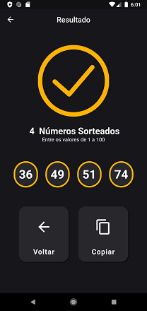
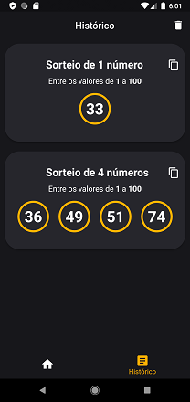

# :computer: Meu_Sorteio 

Projeto criado utilizando Flutter e Dart que consiste em gerar(sortear) números aleatórios de acordo com os dados fornecido pelo usuário e com a capacidade de armazenar os resultados em um banco de dados no próprio dispositivo através da biblioteca Sqflite.

## :iphone: Telas da Aplicação 
**1. Home page da aplicação**

 **2. Tela de Resultado**

 **3. Tela de Histórico**

## :package: Packages 	
Foi utilizado no projeto os seguintes packages.

- [Sqflite](https://pub.dev/packages/sqflite)
- [Path](https://pub.dev/packages/path)
